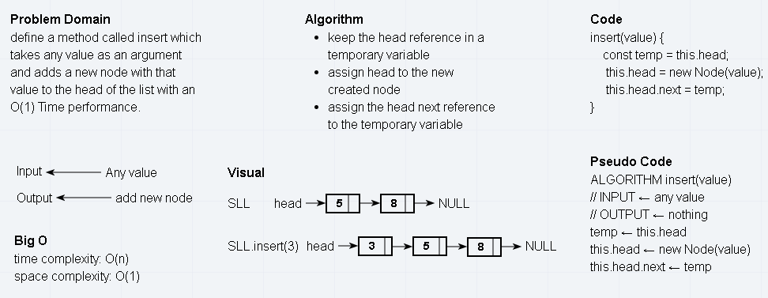
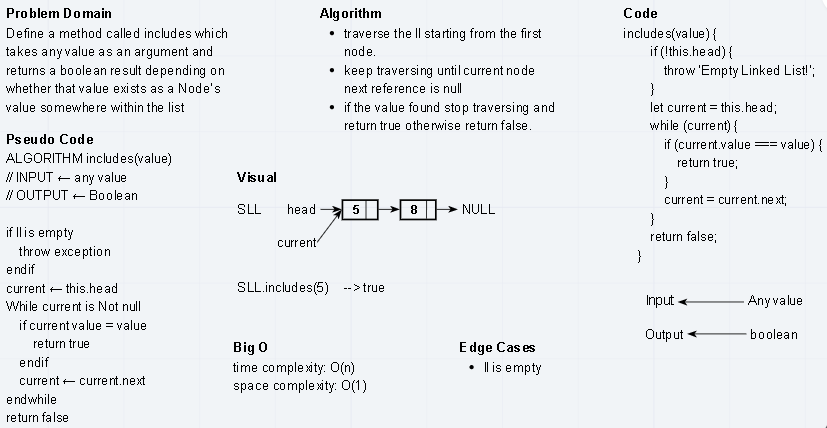
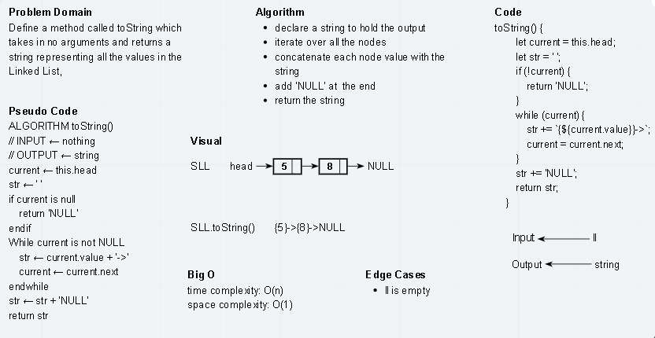

# Singly Linked List
SLL or singly linked list is a linear data structure that consists of nodes, each node contains data and a pointer to the next node. It also has a pointer to the first node called head.

## Challenge
Implement singly linked list data structure and the following basic operations on it:  
* insert() 
* includes()
* toString()
* append()
* insertBefore()
* insertAfter()
* kthFromEnd()

## Approach & Efficiency  

|method|approach of implementation|Big O|
|------|--------------------------|-----|
|insert()|assign the head to the new node|time, space:O(1)|
|includes()|sequential search|time:O(n), space:O(1)|
|toString()|iterate over ll|time:O(n), space:O(1)|
|append()|traverse the ll until reach last node then add|time:O(n), space:O(1)|
|insertBefore()|traverse the ll using two pointers|time:O(n), space:O(1)|
|insertAfter()|traverse the ll until reach the location required|time:O(n), space:O(1)|
|kthFromEnd()|travserse the ll (ll.length - k) times then return the value|time:O(n), space:O(1)|

## Whiteboard Process
* insert() 
  
* includes()  
  
* toString()  


## API
1. insert(value) -> adds a new node with the given value to the beginning of the list  
2. includes(value) -> return true if the value is found in the LL and false otherwise.  
3. toString() -> returns a string representation of all nodes' values.
4. append(value) -> adds a new node with the given value to the end of the list.  
5. insertBefore(value, newValue) -> add a new node with the given newValue immediately before the first value node.  
6. insertAfter() -> add a new node with the given newValue immediately after the first value node.  
7. kthFromEnd(k) -> return the node’s value that is k from the end of the linked list

## Solution
```javascript
    // creating a new empty SLL
    const ll = new LinkedList();

    // insert a new node
    ll.insert(5); 

    // append a new node
    ll.append(6);

    // insert before a node
    ll.insertBefore(5, 4);

    // insert after node
    ll.insertAfter(6, 3);

    // check if 9 is in the ll
    ll.includes(9); // false

    // return ll as formated string
    ll.toString(); // {4}->{5}->{6}->{3}->NULL

    ll.kthFromEnd(1); // return 6
```