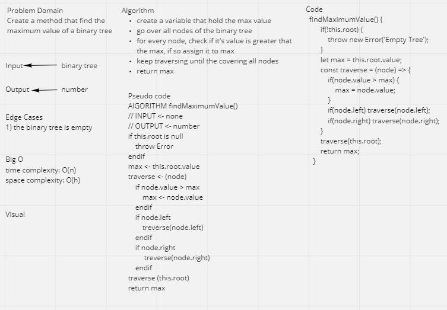

# Trees
tree is a widely used abstract data type that simulates a hierarchical tree structure, with a root value and subtrees of children with a parent node, represented as a set of linked nodes.
A tree data structure can be defined recursively as a collection of nodes (starting at a root node), where each node is a data structure consisting of a value, together with a list of references to nodes (the "children"), with the constraints that no reference is duplicated, and none points to the root.

## Challenge
implement binary treee and binary search tree

## Whitboard

## API
preOrder()  
inOrder()  
postOrder()  
add()  
contains()
findMaximumValue()