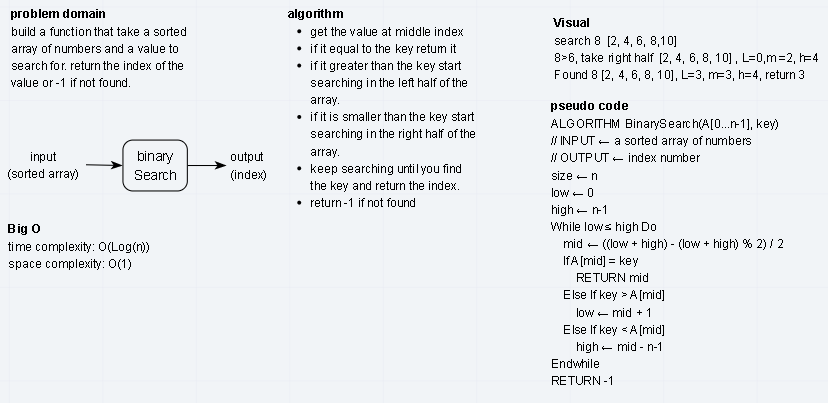

# Search a 1D sorted array
Write a function that search the array for given value.

## Challenge
Write a function called BinarySearch which takes in 2 parameters: a sorted array and the search key. Without utilizing any of the built-in methods available to your language, return the index of the array’s element that is equal to the search key, or -1 if the element does not exist.

## Approach & Efficiency
* I used the binary serach approach where the array is divided in two parts at the middle index then find if the value is greater or less than the value of the array at mid, if it's greater continue searching in the right part otherwise search in the laeft part and so on until the value is found if it dose not found return -1.
  
* this approah is more efficeint in terms of time comlexity. 

- Time Complexity: O(Log(n))
- Space Complexity: O(1)

## Solution
