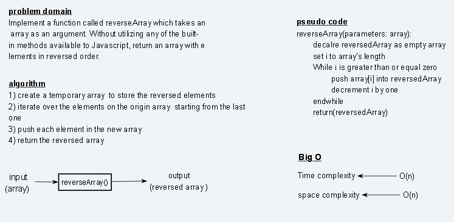

# data-structures-and-algorithms
Code challenges and algorithms for code 401 course 

# Reverse an Array
Create a function that return array in reverse order

## Challenge
Write a function called reverseArray which takes an array as an argument. Without utilizing any of the built-in methods available to your language, return an array with elements in reversed order.

## Approach & Efficiency
* I used a for loop to iterate over the elements of the array starting form last element and push each one in a new local array and then finally return the new array created.

* I used a for loop because I need to go over each element in the origin array so I can store it in the new one.

- Time Complexity: O(n)  
- Space Complexity: O(n)

## Solution
