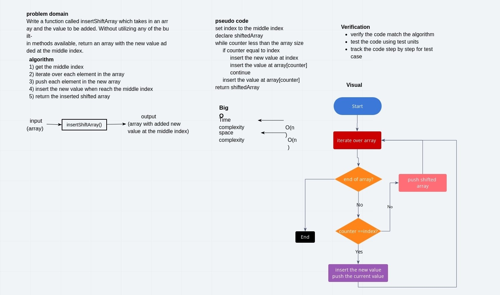

# Inserting into Array
Create a function that add a new value at the middle index

## Challenge
Write a function called insertShiftArray which takes in an array and the value to be added. Without utilizing any of the built-in methods available to your language, return an array with the new value added at the middle index.

## Approach & Efficiency
* I get the middle index to insert the value at and then iterate over the array to copy each value into the shifted new array.

* I used a for loop because I need to go over each element in the origin array so I can store it in the new one.

- Time Complexity: O(n)  
- Space Complexity: O(n)

## Solution
