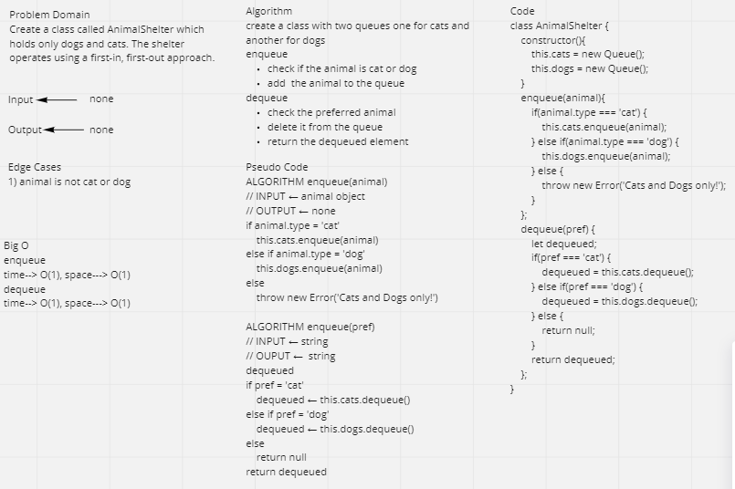

# Challenge Summary
Create a class called AnimalShelter which holds only dogs and cats. The shelter operates using a first-in, first-out approach.

## Whiteboard Process


## Approach & Efficiency
Create two queues to hold cats and dogs. and use the built in method to enqueu and dequeue animal based on the animal's type.

## Solution
```js
    const animal1 = new Animal('FoFo', 'whit', 'cat');
    const animal2 = new Animal('LoLo', 'black', 'cat');
    const animal3 = new Animal('KoKo', 'Cinnamon', 'cat');
    const animal4 = new Animal('SoSo', 'fawn', 'dog');
    const animal5 = new Animal('ZoZo', 'honey', 'dog');

    const shelter = new AnimalShelter();

    shelter.enqueue(animal1);
    shelter.enqueue(animal2);
    shelter.enqueue(animal3);
    shelter.enqueue(animal4);
    shelter.enqueue(animal5);

    console.log(shelter.dequeue('cat')); // Animal { name: 'FoFo', color: 'whit', type: 'cat' }
    console.log(shelter.dequeue('dog')); // Animal { name: 'SoSo', color: 'fawn', type: 'dog' }
```