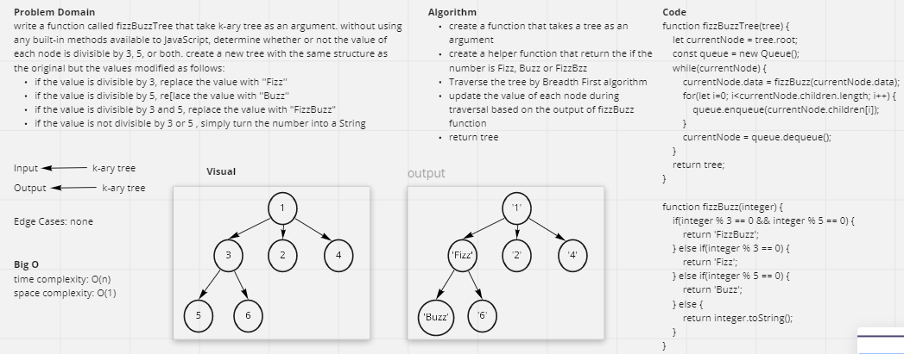

# Challenge Summary
write a function called fizzBuzzTree that take k-ary tree as an argument. without using any built-in methods available to JavaScript, determine whether or not the value of each node is divisible by 3, 5, or both. create a new tree with the same structure as the original but the values modified as follows:

* if the value is divisible by 3, replace the value with ''Fizz''
* if the value is divisible by 5, re[lace the value with ''Buzz''
* if the value is divisible by 3 and 5, replace the value with "FizzBuzz"
* if the value is not divisible by 3 or 5 , simply turn the number into a String

## Whiteboard Process


## Approach & Efficiency
I used Breadth first algorithm to traverse the tree and uspated the value of each node based on the output from fizzBuzz function.  

time: O(n)  
space: O(1)

## Solution
```js
    // create 3-ary tree
    const tree = new Tree(1);

    tree.root.children.push(new Node(3));
    tree.root.children.push(new Node(2));
    tree.root.children.push(new Node(4));
    tree.root.children[0].children.push(new Node(5));
    tree.root.children[0].children.push(new Node(6));

    console.log(fizzBuzzTree(tree)); // [ '1', 'Fizz', '2', '4', 'Buzz', 'Fizz' ]
```