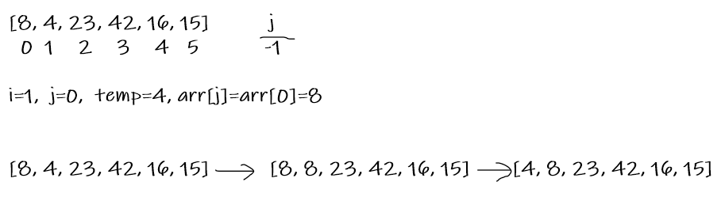
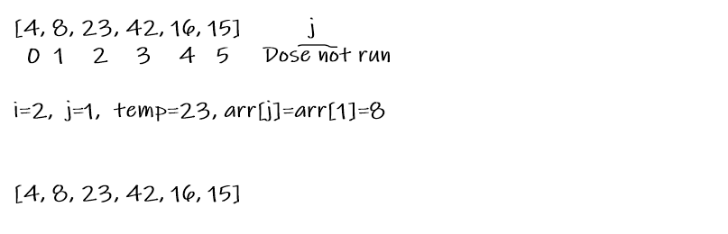
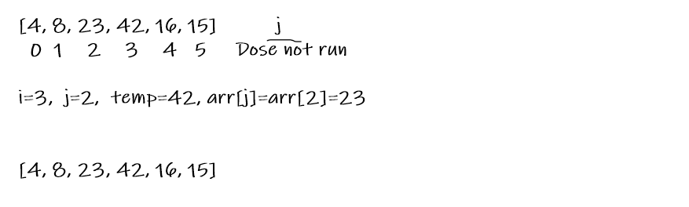
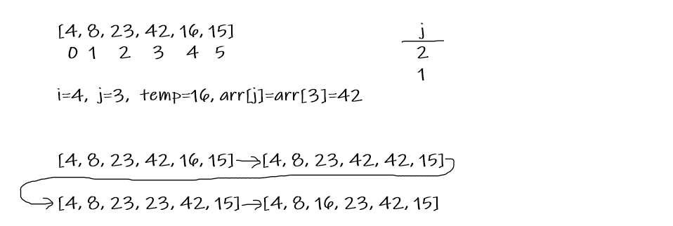
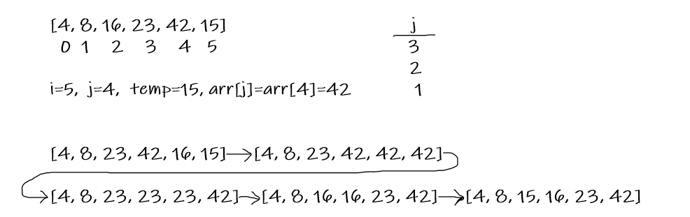

# Inserion Sort
Insertion sort is the sorting mechanism where the sorted array is built having one item at a time. The array elements are compared with each other sequentially and then arranged simultaneously in some particular order.

## Pseudocode
```
  InsertionSort(int[] arr)
  
    FOR i = 1 to arr.length
    
      int j <-- i - 1
      int temp <-- arr[i]
      
      WHILE j >= 0 AND temp < arr[j]
        arr[j + 1] <-- arr[j]
        j <-- j - 1
        
      arr[j + 1] <-- temp

```

## Trace

Sample Array: [8,4,23,42,16,15]

**Pass 1**:  
  
In the first pass, we evaluate if the number in index 1 is smaller than the first number in index 0 and so becuase that change the value cuurently in index 0 to 4 and update the value at index 1 to 8.  
**Pass 2**:  
  
In the second pass, we breake out of the while because the condition is not met, so it still the same and i is incremented by one.  
**Pass 3**:  
  
In the third pass also the next number is greter than the one before it, so the while will not run and we stick to latest change.  
**Pass 4**:  

In the fourth pass, the next number at index 4 is less than the number at index 3, so iy's changed to 42 and also it's smaller than the unmber at index 2.  
**Pass 5**:  
  

## Efficency
* Time: O(n*n)
* Space: O(1)