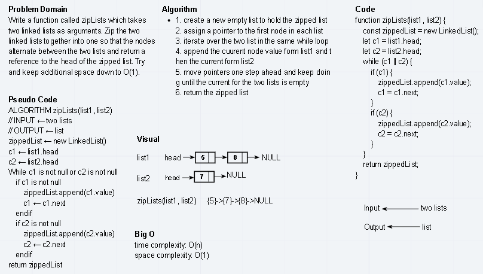

# Challenge Summary
Write a function called zipLists which takes two linked lists as arguments. Zip the two linked lists together into one so that the nodes alternate between the two lists and return a reference to the head of the zipped list. Try and keep additional space down to O(1). 

## Whiteboard Process


## Approach & Efficiency
1. create a new empty list to hold the zipped list
2. assign a pointer to the first node in each list
3. iterate over the two list in the same while loop
4. append the cuurent node value form list1 and then the current form list2
5. move pointers one step ahead and keep doing until the current for the two lists is empty
6. return the zipped list

time complexity: O(n)
space complexity: O(1)

## Solution
```js
    // create two empty lists
    const list1 = new LinkedList();
    const list2 = new LinkedList();

    // add some data to the lists
    list1.append(1);
    list1.append(2);
    list1.append(3);
    list1.append(4);
    list1.append(5);
    list1.append(6);

    // zip lists
    zipLists(list1, list2).toString(); //{1}->{4}->{2}->{5}->{3}->{6}->NULL
```