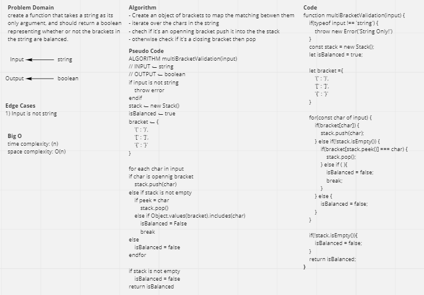

# Challenge Summary
create a function that takes a string as its only argument, and should return a boolean representing whether or not the brackets in the string are balanced.

## Whiteboard Process


## Approach & Efficiency
- Create an object of brackets to map the matching betwen them
- iterate over the chars in the string
- chech if it's an openning bracket push it into the the stack
- otherwise check if it's a closing bracket then pop

## Solution
```js
    console.log(multiBracketValidation('{}')); // true
    console.log(multiBracketValidation('{}(){}')); // true
    console.log(multiBracketValidation('()[[Extra Characters]]')); // true
    console.log(multiBracketValidation('(){}[[]]')); // true
    console.log(multiBracketValidation('{}{Code}[Fellows](())')); // true
    console.log(multiBracketValidation('[({}]')); // false
    console.log(multiBracketValidation('(]('));// false
    console.log(multiBracketValidation('{(})'));// false
    console.log(multiBracketValidation('{'));// false
    console.log(multiBracketValidation(')'));// false
    console.log(multiBracketValidation('[}'));// false
```
