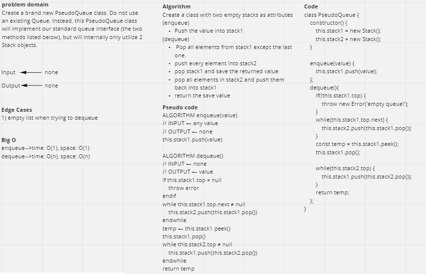

# Challenge Summary
Create a brand new PseudoQueue class. Do not use an existing Queue. Instead, this PseudoQueue class will implement our standard queue interface (the two methods listed below), but will internally only utilize 2 Stack objects.

## Whiteboard Process


## Approach & Efficiency
By creating a constructor that have two stack objects and use them to implement the enqueue and dequeue methods through moving the element back and forth between these  two stacks and then save the final result into stack 1.

## Solution
```js
    const q = new PseudoQueue();
    q.enqueue(20);
    q.enqueue(15);
    q.enqueue(10);
    q.enqueue(5);

    console.log(q.stack1.toString()); // top->{5}->{10}->{15}->{20}->NULL
    console.log(q.dequeue()); // 20
    console.log(q.stack1.toString()); // top->{5}->{10}->{15}->NULL
    q.dequeue();
    q.dequeue();
    console.log(q.stack1.toString()); // top->{5}->NULL
    q.dequeue();
    console.log(q.stack1.toString()); // top->NULL
```